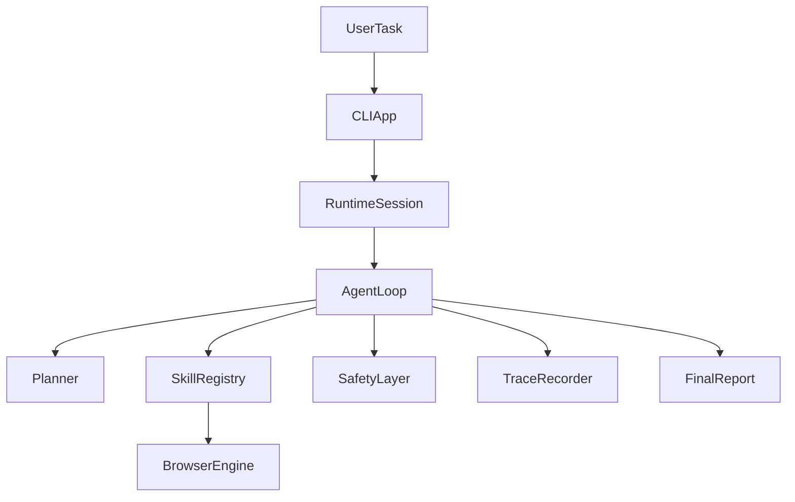

# Browser Agent Foundation

`browser-agent-foundation` is a Python-first project scaffold for an autonomous browser agent that can accept a natural-language task, operate inside a browser session, and keep running until the task is complete or it needs more input from the user.

The current repository intentionally focuses on the engineering foundation rather than full task automation. It sets up the architecture, typed contracts, safety model, runtime loop skeleton, and developer-facing documentation required to build a strong demo-ready system without hardcoded task flows.

## Goals

- Build an LLM-driven browser agent loop that reasons from the current page state.
- Keep runtime skills modular and registry-driven instead of task-specific.
- Enforce human confirmation before destructive or high-risk actions.
- Make the system observable through structured trace items and final reports.
- Keep the codebase easy to extend for scenarios like inbox cleanup, food ordering, and job applications.

## Non-Goals For This Stage

- Shipping a fully autonomous production agent.
- Encoding scenario-specific pipelines such as "if task is spam cleanup, execute X".
- Hiding missing implementation behind fake generic abstractions.
- Building a monolithic runtime in a single module.

## High-Level Architecture

The project is split into small modules with explicit boundaries:

- `cli`: terminal-style entrypoint and operator UX.
- `runtime`: session state, trace handling, loop orchestration, final reporting.
- `llm`: planner contracts, prompts, and structured parser boundaries.
- `browser`: browser adapter interfaces and page-state models.
- `skills`: registry-driven runtime skills such as observation, navigation, interaction, safety, and reporting.
- `safety`: destructive action classification and confirmation flow.
- `docs`: architecture, runtime, skills, rules, and roadmap documents.



## Repository Layout

```text
docs/                  Architecture, rules, and roadmap
src/browser_agent/     Runtime, browser, safety, skills, and CLI packages
tests/                 Smoke and contract tests for the foundation
```

## Running The Foundation

1. Create a virtual environment.
2. Install the package with development dependencies.
3. Run the CLI.

```bash
python -m venv .venv
source .venv/bin/activate
pip install -e .[dev]
browser-agent "Review my inbox for spam"
```

You can also pass flags:

```bash
browser-agent --start-url https://mail.example.com --max-steps 12 "Delete obvious spam"
```

## Current Status

Current stage: foundation only.

What already exists:

- architecture documents and project rules;
- typed runtime models for the agent loop and tool contracts;
- a modular skill system with a default registry;
- a safety layer for confirmation gating;
- a minimal CLI bootstrap and smoke tests.

What is intentionally not implemented yet:

- a real Playwright-backed browser engine;
- an LLM integration that produces live decisions from prompts;
- persistent memory beyond the in-memory runtime session;
- scenario execution depth for inbox, food, or job workflows.

## Key Design Principles

- No hardcoded task-specific pipelines.
- No destructive action without explicit confirmation.
- No large ambiguous modules with mixed responsibilities.
- No undocumented or untyped runtime tool interfaces.
- Every decision should be explainable from observation plus trace history.

## Documentation

- `docs/architecture.md`
- `docs/agent-runtime.md`
- `docs/subagents.md`
- `docs/skills.md`
- `docs/rules.md`
- `docs/roadmap.md`

## Next Steps

The next milestone is to replace the stub browser engine with a Playwright adapter, wire the planner to a real LLM, and evolve the agent loop from bootstrap mode into a fully observable autonomous runtime.
