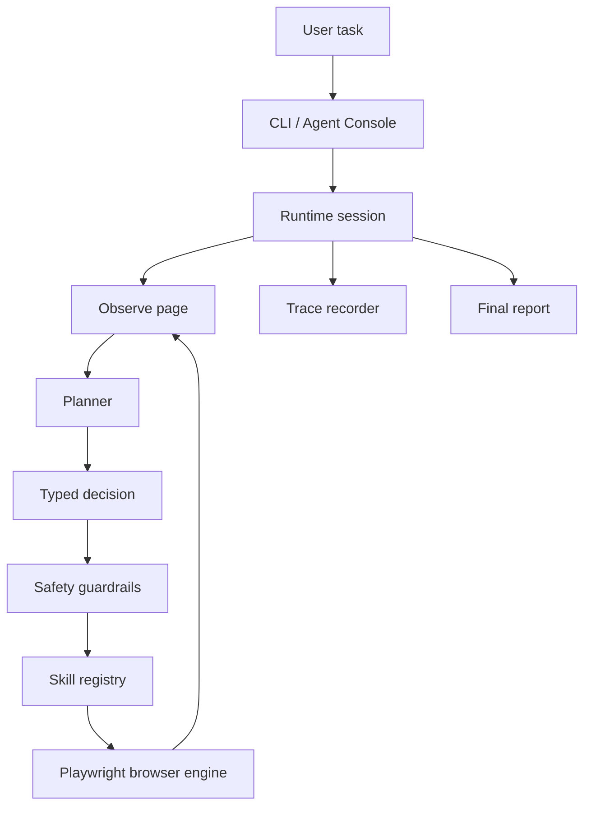

# Browser Agent Foundation


Python foundation for building LLM-driven browser agents with a real multi-step runtime, typed planner contracts, Playwright browser control, and safety-first guardrails.

This project is designed for agents that:

- take a natural-language task;
- observe the current page;
- choose the next typed action;
- execute only registered skills;
- stop for confirmation before risky actions;
- produce traces and a final report you can inspect.

## Why this project

Most browser-agent demos either hardcode workflows or hide missing pieces behind vague abstractions. This repository takes the opposite approach: keep the loop real, keep the contracts typed, and keep the system honest about what is and is not implemented.

## What you get

| Area | Included |
| --- | --- |
| Runtime loop | Real `observe -> plan -> guardrail -> act -> re-observe` execution |
| Browser layer | Playwright-backed navigation, clicking, typing, scrolling, text extraction |
| Planner boundary | Strict typed decisions: `act`, `ask_user`, `request_confirmation`, `finish`, `fail` |
| Skills | Registry-driven, modular runtime skills instead of task-specific pipelines |
| Safety | Confirmation gate for destructive or high-risk actions |
| Operator UX | Optional Rich terminal UI with phases, step history, tokens, cost, and prompts |
| Tracing | Structured reports, JSONL traces, and optional screenshots |
| Demos | Local offline demo pages for food ordering, job search, and inbox spam review |
| Testing | Smoke, parser, contract, selector, runtime, UI, and browser integration tests |

## Quick Start

### 1. Install from source

```bash
python -m venv .venv
source .venv/bin/activate
pip install -e .[dev]
python -m playwright install chromium
```

Requirements:

- Python 3.10+
- Chromium installed through Playwright
- API access for a supported planner backend

### 2. Configure the planner

The easiest path is the built-in setup wizard:

```bash
browser-agent setup
browser-agent doctor
browser-agent status
```

This stores config in `~/.browser-agent/config.yaml`.

### 3. Run the agent

```bash
browser-agent "Review this page" --start-url https://example.com
browser-agent run --ui --headed --start-url https://example.com "Inspect the page and summarize"
browser-agent demo food --ui
```

## CLI Overview

| Command | Purpose |
| --- | --- |
| `browser-agent setup` | Install Chromium, collect API settings, and run smoke checks |
| `browser-agent doctor` | Validate Python, Playwright, config, and planner reachability |
| `browser-agent demo <food\|jobs\|spam>` | Run a bundled local demo page |
| `browser-agent status` | Show version and configuration summary |
| `browser-agent reset` | Remove `~/.browser-agent/config.yaml` |
| `browser-agent run ...` | Run a natural-language task |
| `browser-agent "..."` | Bare task mode; shorthand for `run` |

### Run modes

```bash
browser-agent --ui --headed --start-url https://example.com "Inspect the page"
browser-agent --capture-screenshots --start-url https://example.com --json "Observe the page"
browser-agent run --chat --ui --headed --start-url https://example.com "Start a browsing session"
```

Notes:

- `--ui` enables the Rich Agent Console with live phases and operator prompts.
- `--json` cannot be combined with `--ui`.
- `--chat` keeps the browser open between turns.
- Bare task mode is treated as `browser-agent run`.

## Demos

Bundled demos run on local HTML pages served from `127.0.0.1`, so the pages themselves do not require internet access.

```bash
browser-agent demo food --ui
browser-agent demo jobs --ui
browser-agent demo spam --ui
```

Included scenarios:

- `food`: order a demo meal from a local menu page
- `jobs`: filter demo job listings and find a matching role
- `spam`: inspect a demo inbox and mark suspicious messages as spam

## Configuration

You can use `browser-agent setup`, or configure the planner manually through environment variables.

<details>
<summary>OpenAI-compatible example</summary>

```bash
BROWSER_AGENT_PLANNER_ENABLED=true
BROWSER_AGENT_PLANNER_PROVIDER=openai_compatible
BROWSER_AGENT_PLANNER_BASE_URL=https://api.openai.com/v1
BROWSER_AGENT_PLANNER_MODEL=gpt-4o-mini
BROWSER_AGENT_PLANNER_API_KEY=sk-...
```

</details>

<details>
<summary>Google Gemini-compatible example</summary>

```bash
BROWSER_AGENT_PLANNER_ENABLED=true
BROWSER_AGENT_PLANNER_PROVIDER=google_compatible
BROWSER_AGENT_PLANNER_BASE_URL=https://generativelanguage.googleapis.com/v1beta
BROWSER_AGENT_PLANNER_MODEL=gemini-flash-latest
BROWSER_AGENT_PLANNER_API_KEY=AIza...
```

</details>

The repository also includes `.env.example` if you prefer env-based setup for local development.

## How it works



Core boundary:

```text
planner -> typed skills -> browser adapter
```

## Repository Layout

```text
src/browser_agent/     Runtime, browser engine, CLI, UI, skills, safety, planner
tests/                 Smoke, runtime, parser, selector, UI, and integration tests
docs/                  Architecture, runtime notes, rules, demos, and roadmap
demos/                 Local HTML demo pages
traces/                Session artifacts produced by runs
```

## Documentation

- [Architecture](docs/architecture.md)
- [Agent Runtime](docs/agent-runtime.md)
- [Skills](docs/skills.md)
- [Human Checkpoints](docs/human-checkpoints.md)
- [Demo Notes](docs/demo.md)
- [Rules](docs/rules.md)
- [Roadmap](docs/roadmap.md)

## Current Status

What is already real:

- multi-step runtime with repeated observation and replanning;
- Playwright-backed browser actions;
- typed planner parsing and validation;
- guardrails and confirmation checkpoints;
- Rich terminal UI for operator-facing runs;
- trace artifacts and structured final reports.

What is still intentionally limited:

- this is not a fully autonomous production agent;
- long-lived memory is not implemented beyond process state and trace artifacts;
- scenario depth is still shallow for inbox, food, and job workflows;
- provider support is intentionally narrow and explicit.

## Development

Run tests with:

```bash
pytest
```

If Playwright is missing or the browser install is broken, start with:

```bash
browser-agent doctor
```

## Design Principles

- No hardcoded scenario pipelines.
- No destructive action without explicit confirmation.
- No fake autonomy when planner configuration is missing.
- No oversized modules with mixed responsibilities.
- No untyped runtime tool boundaries.
