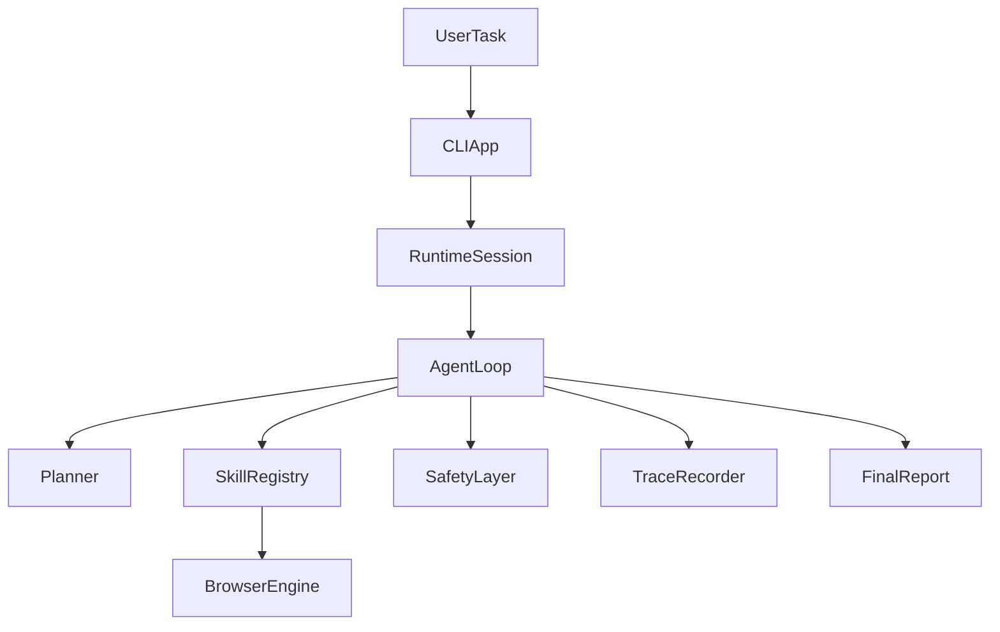

# Browser Agent Foundation

`browser-agent-foundation` is a Python-first project scaffold for an autonomous browser agent that can accept a natural-language task, operate inside a browser session, and keep running until the task is complete or it needs more input from the user.

The repository now includes a real Playwright-backed browser runtime skeleton. It keeps the original architectural boundaries intact while replacing the stub browser layer with live navigation, observation, interaction, and trace collection primitives that are honest enough for demos and further planner work.

## Goals

- Build an LLM-driven browser agent loop that reasons from the current page state.
- Keep runtime skills modular and registry-driven instead of task-specific.
- Enforce human confirmation before destructive or high-risk actions.
- Make the system observable through structured trace items and final reports.
- Keep the codebase easy to extend for scenarios like inbox cleanup, food ordering, and job applications.

## Non-Goals For This Stage

- Shipping a fully autonomous production agent.
- Encoding scenario-specific pipelines such as "if task is spam cleanup, execute X".
- Hiding missing implementation behind fake generic abstractions.
- Building a monolithic runtime in a single module.

## High-Level Architecture

The project is split into small modules with explicit boundaries:

- `cli`: terminal-style entrypoint and operator UX.
- `runtime`: session state, trace handling, loop orchestration, final reporting.
- `llm`: planner contracts, prompts, and structured parser boundaries.
- `browser`: browser adapter interfaces and page-state models.
- `skills`: registry-driven runtime skills such as observation, navigation, interaction, safety, and reporting.
- `safety`: destructive action classification and confirmation flow.
- `docs`: architecture, runtime, skills, rules, and roadmap documents.



## Repository Layout

```text
docs/                  Architecture, rules, and roadmap
src/browser_agent/     Runtime, browser, safety, skills, and CLI packages
tests/                 Smoke and contract tests for the foundation
```

## Running The Foundation

1. Create a virtual environment.
2. Install the package with development dependencies.
3. Install Playwright browser binaries.
4. Run the CLI.

```bash
python -m venv .venv
source .venv/bin/activate
pip install -e .[dev]
playwright install chromium
browser-agent "Review my inbox for spam"
```

You can also pass flags:

```bash
browser-agent --headed --start-url https://example.com --max-steps 12 "Inspect the page"
browser-agent --capture-screenshots --start-url https://example.com --json "Observe the current page"
```

If the `playwright` shell command is unavailable in your environment, run the browser install step through Python instead:

```bash
python -m playwright install chromium
```

## Current Status

Current stage: real browser runtime skeleton.

What already exists:

- architecture documents and project rules;
- typed runtime models for the agent loop and tool contracts;
- a modular skill system with a default registry;
- a safety layer for confirmation gating;
- a real Playwright-backed browser adapter with lifecycle management;
- real page observation, interactive element extraction, navigation, clicking, typing, and text extraction;
- structured execution trace artifacts with step metadata and optional screenshots;
- smoke, contract, selector, runtime-mapping, and local browser integration tests.

What is intentionally not implemented yet:

- an LLM integration that produces live decisions from prompts;
- deep multi-step autonomous planning beyond the foundation bootstrap planner;
- confirmation resume flows after `waiting_for_user`;
- persistent memory beyond the current process and trace artifacts;
- scenario execution depth for inbox, food, or job workflows.

## Demo Reality

The CLI now runs a real browser session. The current demo flow is intentionally narrow and honest:

- if `--start-url` is provided, the foundation planner performs one typed `navigate` action;
- the runtime captures a real `observe_page` snapshot through Playwright;
- the task finishes with a transparent report that explains the planner is still foundation-level.

This repository still does not claim general autonomy. The browser runtime is real; the planner remains intentionally small.

## Key Design Principles

- No hardcoded task-specific pipelines.
- No destructive action without explicit confirmation.
- No large ambiguous modules with mixed responsibilities.
- No undocumented or untyped runtime tool interfaces.
- Every decision should be explainable from observation plus trace history.

## Documentation

- `docs/architecture.md`
- `docs/agent-runtime.md`
- `docs/subagents.md`
- `docs/skills.md`
- `docs/rules.md`
- `docs/roadmap.md`

## Next Steps

The next milestone is to replace the foundation planner with a real LLM-backed planner, expand reusable browser skills, and evolve the current browser skeleton into a multi-step autonomous runtime without introducing task-specific scripts.
