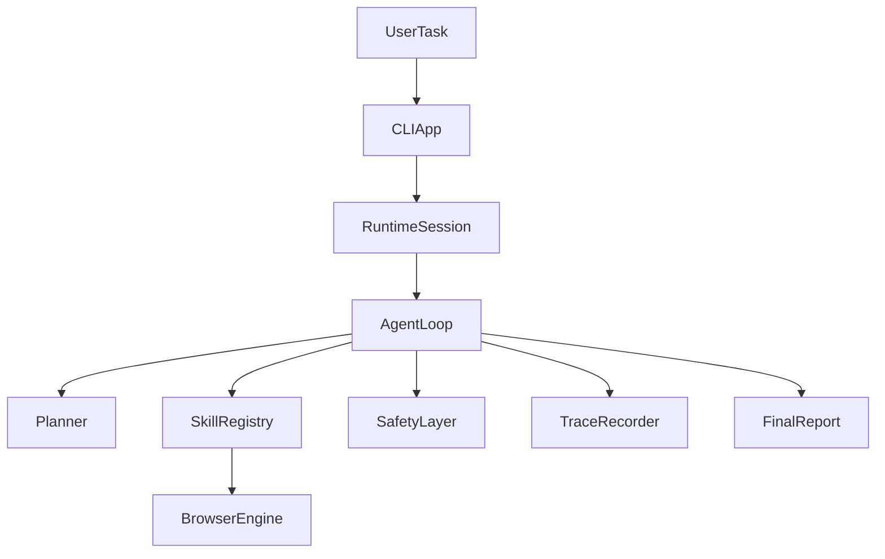

# Browser Agent Foundation

`browser-agent-foundation` is a Python-first project scaffold for an autonomous browser agent that can accept a natural-language task, operate inside a browser session, and keep running until the task is complete or it needs more input from the user.

The repository now includes a real typed planner layer, a real multi-step runtime loop, and a real Playwright-backed browser stack. The core architectural boundary remains the same: planner -> typed skills -> browser adapter.

## Goals

- Build an LLM-driven browser agent loop that reasons from the current page state.
- Keep runtime skills modular and registry-driven instead of task-specific.
- Enforce human confirmation before destructive or high-risk actions.
- Make the system observable through structured trace items and final reports.
- Keep the codebase easy to extend for scenarios like inbox cleanup, food ordering, and job applications.

## Non-Goals For This Stage

- Shipping a fully autonomous production agent.
- Encoding scenario-specific pipelines such as "if task is spam cleanup, execute X".
- Hiding missing implementation behind fake generic abstractions.
- Building a monolithic runtime in a single module.

## High-Level Architecture

The project is split into small modules with explicit boundaries:

- `cli`: terminal-style entrypoint and operator UX.
- `runtime`: session state, trace handling, loop orchestration, final reporting.
- `llm`: planner contracts, prompts, and structured parser boundaries.
- `browser`: browser adapter interfaces and page-state models.
- `skills`: registry-driven runtime skills such as observation, navigation, interaction, safety, and reporting.
- `safety`: destructive action classification and confirmation flow.
- `docs`: architecture, runtime, skills, rules, and roadmap documents.



## Repository Layout

```text
docs/                  Architecture, rules, and roadmap
src/browser_agent/     Runtime, browser, safety, skills, and CLI packages
tests/                 Smoke and contract tests for the foundation
```

## Running The Runtime

1. Create a virtual environment.
2. Install the package with development dependencies.
3. Install Playwright browser binaries.
4. Configure the planner.
5. Run the CLI.

```bash
python -m venv .venv
source .venv/bin/activate
pip install -e .[dev]
playwright install chromium
browser-agent "Review my inbox for spam"
```

You can also pass flags:

```bash
browser-agent --headed --start-url https://example.com --max-steps 12 "Inspect the page"
browser-agent --capture-screenshots --start-url https://example.com --json "Observe the current page"
```

If the `playwright` shell command is unavailable in your environment, run the browser install step through Python instead:

```bash
python -m playwright install chromium
```

The multi-step planner is not enabled by default. Configure it through environment variables or a `.env` file:

1. Copy `.env.example` to `.env` or `.env.browser-agent`:
   ```bash
   cp .env.example .env.browser-agent
   ```

2. Edit the file and set your API key and provider.

3. Run:
   ```bash
   browser-agent --start-url https://example.com "Inspect the current page"
   ```

### Provider: OpenAI-compatible

```bash
BROWSER_AGENT_PLANNER_ENABLED=true
BROWSER_AGENT_PLANNER_PROVIDER=openai_compatible
BROWSER_AGENT_PLANNER_BASE_URL=https://api.openai.com/v1
BROWSER_AGENT_PLANNER_MODEL=gpt-4o-mini
BROWSER_AGENT_PLANNER_API_KEY=sk-...
```

### Provider: Google Gemini

```bash
BROWSER_AGENT_PLANNER_ENABLED=true
BROWSER_AGENT_PLANNER_PROVIDER=google_compatible
BROWSER_AGENT_PLANNER_BASE_URL=https://generativelanguage.googleapis.com/v1beta
BROWSER_AGENT_PLANNER_MODEL=gemini-flash-latest
BROWSER_AGENT_PLANNER_API_KEY=AIza...
```

- For Google AI Studio, get your API key at https://aistudio.google.com/app/apikey
- The `BASE_URL` can be just the host (e.g. `https://generativelanguage.googleapis.com/v1beta`) — the model ID and `:generateContent` are appended automatically.

If the planner is not configured, the CLI now says so explicitly instead of falling back to fake autonomy.

## Current Status

Current stage: real multi-step planner/runtime integration.

What already exists:

- architecture documents and project rules;
- typed runtime models for the agent loop and tool contracts;
- a strict planner decision contract with structured `act`, `ask_user`, `request_confirmation`, `finish`, and `fail` outcomes;
- a minimal OpenAI-compatible planner provider abstraction plus fake provider support for tests;
- a strict planner parser that validates JSON, skill names, and skill arguments before runtime execution;
- a modular skill system with a default registry;
- a safety layer for confirmation gating;
- a real Playwright-backed browser adapter with lifecycle management;
- real page observation, interactive element extraction, navigation, clicking, typing, and text extraction;
- a real multi-step observe -> plan -> guardrail -> execute -> re-observe loop;
- deterministic progress detection and stagnation protection;
- structured execution trace artifacts with planner decisions, progress outcomes, and optional screenshots;
- smoke, parser, contract, selector, runtime, and local browser integration tests.

What is intentionally not implemented yet:

- full conversational resume UX in the CLI after confirmation or user-question pauses;
- persistent memory beyond the current process and trace artifacts;
- multiple LLM provider adapters beyond the current OpenAI-compatible transport;
- scenario execution depth for inbox, food, or job workflows.

## Demo Reality

The CLI now runs a real multi-step browser session when the planner is configured. The current demo flow is intentionally honest:

- the runtime performs a real observation before each planning step;
- the planner chooses one typed atomic next step at a time;
- the runtime executes only registered skills and re-observes after execution;
- risky actions pause for explicit confirmation;
- blocking ambiguity pauses for a user answer;
- the loop stops with a final report, a confirmation request, or a blocking user question.

This repository still does not claim unrestricted general autonomy. The loop is real, but it remains bounded, typed, safety-gated, and intentionally provider-minimal.

## Key Design Principles

- No hardcoded task-specific pipelines.
- No destructive action without explicit confirmation.
- No large ambiguous modules with mixed responsibilities.
- No undocumented or untyped runtime tool interfaces.
- Every decision should be explainable from observation plus trace history.

## Documentation

- `docs/architecture.md`
- `docs/agent-runtime.md`
- `docs/subagents.md`
- `docs/skills.md`
- `docs/rules.md`
- `docs/roadmap.md`

## Next Steps

The next milestone is to improve resume UX, expand the reusable skill set, and harden planner behavior on more dynamic real-world pages without introducing task-specific scripts.
