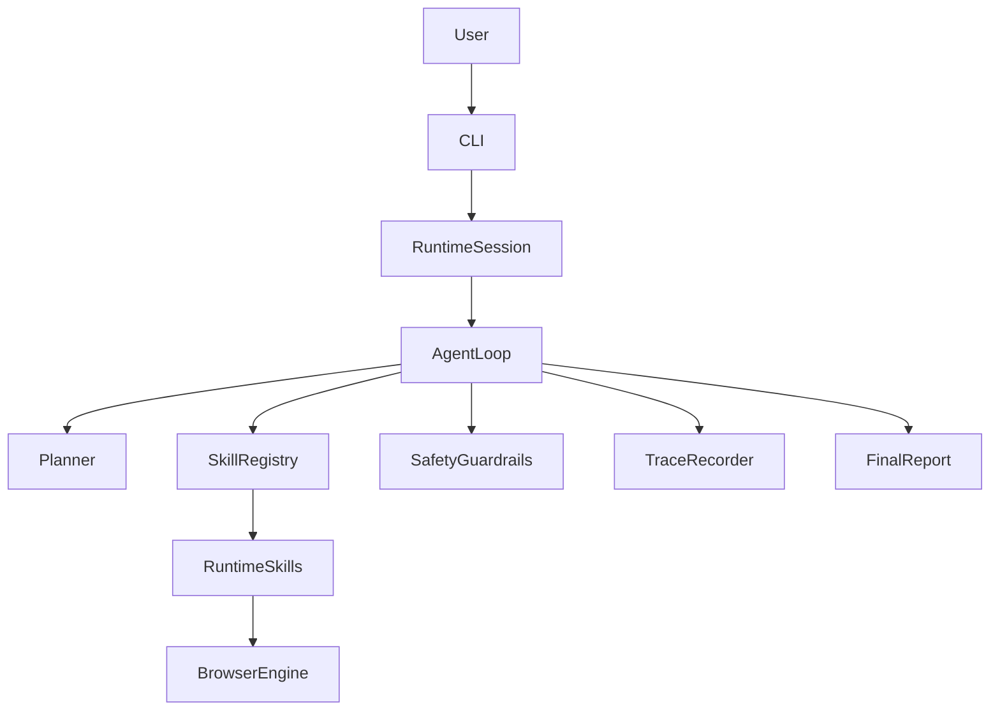

# Architecture

## Intent

The system is designed as a modular foundation for an autonomous browser agent that can:

- accept a natural-language user task;
- observe the current browser state;
- reason about the next action;
- execute the action through typed skills;
- request confirmation before risky operations;
- produce a traceable final report.

This document defines the primary system components and the responsibility boundaries between them.

## Architectural Principles

- The runtime must be observation-driven, not scenario-driven.
- Browser automation must be isolated behind a dedicated adapter.
- Skills must be registered and invoked by contract, not by task-specific branching.
- Safety decisions must be explicit and independent from the planner.
- Every meaningful action must be traceable.
- Each module should have one primary responsibility.

## Component Map

## Main Components

### CLI

Purpose:
- entrypoint for the terminal/chat style interface;
- accepts the user task and runtime parameters;
- initializes the session and reports progress back to the operator.

Responsibilities:
- parse input arguments;
- build configuration and runtime dependencies;
- start the runtime loop or bootstrap flow;
- render a report in a readable form.

Out of scope:
- browser automation internals;
- action classification logic;
- prompt construction.

### Runtime Loop

Purpose:
- orchestrate the autonomous control cycle.

Responsibilities:
- maintain the high-level loop `observe -> reason -> choose -> execute -> re-observe`;
- keep step counters and stop conditions;
- coordinate planner, skill registry, safety checks, and trace recorder;
- produce the final report or a confirmation request handoff.

Out of scope:
- direct Playwright calls;
- task-specific policies;
- UI rendering.

### Runtime Session And Memory

Purpose:
- store the working state of a single user task execution.

Responsibilities:
- hold the original `UserTask`;
- persist observation, thought, action, and tool-result history;
- expose concise state summaries to the planner;
- keep pending confirmation requests and execution metadata.

Out of scope:
- persistent storage beyond the current process;
- action execution rules;
- browser lifecycle management.

### Planner

Purpose:
- transform the current task context and session state into the next typed decision.

Responsibilities:
- inspect the latest observation and execution history;
- produce an `AgentThought`;
- propose the next `AgentAction` or signal that the user must answer a question;
- explain why the chosen action is appropriate.

Out of scope:
- bypassing safety checks;
- invoking browser APIs directly;
- hardcoded scenario branches.

### Browser Adapter

Purpose:
- abstract browser operations behind a stable interface.

Responsibilities:
- manage Playwright browser/context/page lifecycle and page navigation;
- expose compact page snapshots, interactive elements, and form-field summaries;
- execute atomic browser actions used by skills;
- resolve element references through deterministic selector priorities instead of task heuristics;
- return structured results instead of raw automation primitives.

Out of scope:
- planning logic;
- risk classification;
- final report generation.

### Skill Registry

Purpose:
- provide the runtime with a typed catalog of executable skills.

Responsibilities:
- register skill implementations;
- expose discovery and lookup by skill name;
- enforce consistent input and output schema handling;
- bootstrap the default MVP skill set.

Out of scope:
- deciding when a skill should run;
- browser state storage;
- confirmation policy.

### Safety Layer

Purpose:
- prevent unreviewed destructive actions.

Responsibilities:
- classify action risk levels;
- identify destructive or high-impact operations;
- require confirmation when policy says so;
- build `ConfirmationRequest` objects for user handoff.

Out of scope:
- page observation;
- planner prompts;
- CLI formatting.

### Logging And Trace

Purpose:
- make the runtime observable and auditable.

Responsibilities:
- record execution trace items with timestamps, durations, URL/title context, and status;
- store action rationale and structured tool outcomes;
- keep a minimal audit trail for safety-sensitive operations;
- optionally persist JSONL/Markdown trace artifacts and bounded screenshots for debugging and demos.

Out of scope:
- deciding runtime control flow;
- parsing browser DOM structures.

### Output And Reporting

Purpose:
- summarize what happened and what remains.

Responsibilities:
- report whether the task completed, paused, failed, or is waiting for the user;
- summarize actions taken and constraints encountered;
- list follow-up questions or missing information;
- point to trace or artifact references.

Out of scope:
- low-level trace collection;
- browser command execution.

## Data Flow

1. The operator provides a `UserTask`.
2. The CLI creates a `RuntimeSession`.
3. The runtime loop asks the planner for the next step based on session state.
4. The planner emits a typed action.
5. The safety layer classifies the action before execution.
6. If approved, the runtime resolves the action to a registered skill.
7. The skill interacts with the browser adapter or other runtime services.
8. The result is recorded as a trace item, persisted to trace artifacts when configured, and stored in the session.
9. The loop continues until the task completes or needs user input.

## Responsibility Boundaries

To keep the system maintainable, these boundaries are strict:

- `runtime` can orchestrate but should not implement Playwright logic.
- `browser` can automate the page but should not decide what to do next.
- `llm` can plan and parse, but it cannot bypass typed contracts.
- `skills` can execute one unit of work, but they should not embed multi-step workflows.
- `safety` can block or request confirmation, but it should not mutate browser state.
- `cli` can render state, but it should not contain execution policies.

## Why This Shape

This architecture intentionally leaves space for future growth:

- Playwright can be introduced without rewriting the skill contracts.
- Playwright can remain isolated in `browser/` while `skills` keep the runtime-facing execution surface.
- Different planners can be swapped in without touching runtime orchestration.
- New skills can be added without changing the agent loop structure.
- Safety policies can evolve without coupling them to browser execution logic.

The foundation is deliberately small, but the seams are strong enough to support a real autonomous browser agent in the next phases.
